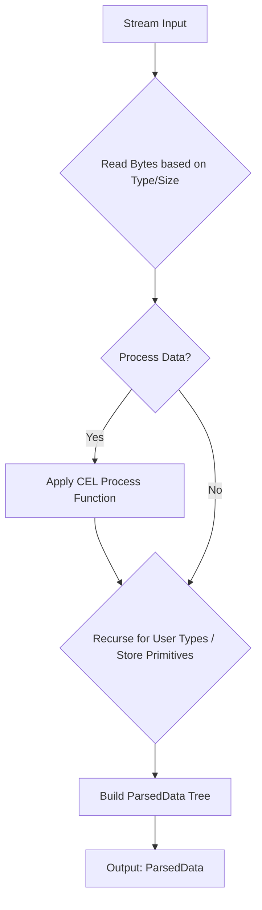
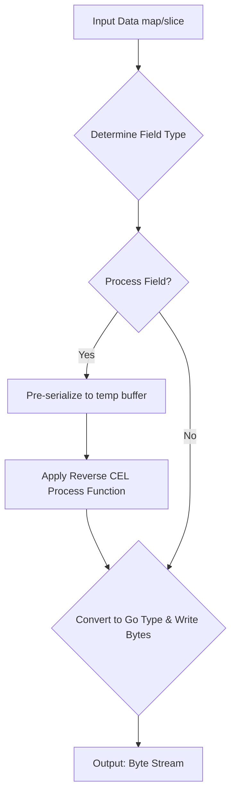

Kaitai Struct Dynamic Parser & Serializer: Technical Documentation
Version: (Specify version if applicable) Last Updated: (Date)

1. Introduction
This document provides a technical overview of the dynamic Kaitai Struct parser (KaitaiInterpreter) and serializer (KaitaiSerializer) implemented in Go. These components allow for runtime parsing and serialization of binary data based on a provided Kaitai Struct schema (.ksy file, represented as KaitaiSchema in Go).

The core functionality revolves around:

Dynamically interpreting a KaitaiSchema.
Leveraging Google's CEL (Common Expression Language) for evaluating conditions, sizes, repetitions, and instance values.
Providing a flexible way to interact with binary formats without pre-generating Go struct code.
2. Core Components & Concepts
2.1. KaitaiSchema
This Go struct (pkg/kaitaistruct/schema.go) is the in-memory representation of a parsed .ksy file. It holds:

Meta: Schema-level metadata (ID, endianness, encoding).
Doc: Documentation strings.
Seq: A sequence of fields defining the structure of the root type or a user-defined type.
Types: A map of user-defined types within the schema.
Instances: A map of calculated values (virtual fields) available within a type.
Enums: A map of enumerations defined in the schema.
2.2. Expression Handling (CEL)
Kaitai Struct relies heavily on expressions. This implementation uses CEL for evaluating these expressions.

internal/cel/ExpressionPool:
Manages the compilation and caching of CEL expressions.
Uses an ASTTransformer to convert Kaitai's expression syntax into valid CEL syntax before compilation.
Provides an extended CEL environment with custom functions.
internal/cel/ASTTransformer:
Takes a Kaitai expression string, parses it into a Kaitai-specific AST (pkg/expression/expression_ast.go).
Traverses this AST and converts it into an equivalent CEL expression string. This involves mapping Kaitai operators, function calls, and special variables (like _io, _parent) to their CEL counterparts or custom CEL functions.
Custom CEL Functions (internal/cel/*Functions.go):
The CEL environment is augmented with numerous custom functions to mimic Kaitai Struct's built-in capabilities. These are organized into libraries:
arrayFunctions: e.g., at() for array access.
bitwiseFunctions: e.g., bitAnd(), bitOr(), bitNot().
kaitaiApiFunctions: Wrappers around kaitai_struct_go_runtime utilities (e.g., bytesToStr(), processXOR()).
mathFunctions: e.g., abs(), min(), max().
processFunctions: e.g., processXOR(), processZlib() (decompression). For serialization, corresponding reverse functions like processZlibCompress() are needed.
streamOperations: Functions to interact with the kaitai.Stream (e.g., pos(), size(), readU1()).
stringFunctions: e.g., to_s(), reverse(), length().
typeConversionFunctions: e.g., to_i(), to_f().
writerOperations: Functions for serialization (e.g., writeU1(), writeBytes()).
encodingFunctions: For string encoding/decoding (e.g., encodeString(), decodeString()).
2.3. Context Objects
ParseContext (pkg/kaitaistruct/parser.go):

Holds the state during a parsing operation for a specific type or field.
Value: The Go value of the currently parsed item (for primitives) or nil for complex types.
Parent: Pointer to the parent ParseContext.
Root: Pointer to the root ParseContext.
IO: The *kaitai.Stream being read from.
Children: A map[string]any storing the parsed Go values of child fields. This map is crucial for providing data to CEL expressions (e.g., field_name, _parent.field_name).
AsActivation(): Converts the ParseContext into a cel.Activation object, making its Children, _io, _root.Children, and _parent.Children available as variables in CEL expressions.
SerializeContext (pkg/kaitaistruct/serializer.go):

Holds the state during a serialization operation.
Value: The Go map[string]any or []any representing the data to be serialized for the current type.
Parent: Pointer to the parent SerializeContext.
Root: Pointer to the root SerializeContext.
Writer: The *kaitai.Writer where data is being written.
Children: A map[string]any which is typically the same as Value for map-like types, providing field data for CEL expressions.
AsActivation(): Converts the SerializeContext into a cel.Activation, making its Children, _writer, _root.Value, and _parent.Value available as variables in CEL expressions.
2.4. ParsedData (pkg/kaitaistruct/parser.go)
The structured output of the KaitaiInterpreter.
Value: The Go value of the parsed item (primitive or []any for arrays).
Children: A map[string]*ParsedData for nested structures.
Type: The Kaitai type name of this node.
IsArray: Boolean indicating if this node represents an array.
3. Parser (KaitaiInterpreter)
The KaitaiInterpreter is responsible for reading a binary stream and constructing a ParsedData tree based on the KaitaiSchema.

3.1. Initialization (NewKaitaiInterpreter)
Takes a *KaitaiSchema and an *slog.Logger.
Initializes an ExpressionPool for CEL evaluation.
Sets up internal stacks (typeStack for circular dependency detection, valueStack for parent context access).
Initializes a ProcessRegistry (though processDataWithCEL currently handles process logic directly).
3.2. Main Parsing Logic (Parse method)
Creates a rootCtx (ParseContext) for the entire parsing operation.
Pushes rootCtx onto the valueStack.
Determines the root type to parse (either schema.Meta.ID or schema.RootType if specified).
Calls parseType(ctx, rootType, stream) to begin parsing.
After the root type is parsed, its result.Children (which are *ParsedData) are used to populate rootCtx.Children with their primitive Values. This makes the top-level fields available for evaluating top-level instances.
Evaluates any top-level schema.Instances using evaluateInstance against the rootCtx. The results are added to the result.Children map.
Returns the final ParsedData tree.
3.3. Type Parsing (parseType method)
This is the central recursive function for parsing structures.

Circular Dependency Check: Pushes typeName onto typeStack and checks for duplicates. Pops upon exit.
Built-in Types: If typeName is a primitive Kaitai type (e.g., "u1", "s2le"), it calls parseBuiltinType to read it directly.
Ad-hoc Switch Types: If typeName contains "switch-on:" (e.g., type: "switch-on: my_expr ? 'type_a' : 'type_b'"):
Extracts the CEL expression.
Creates a temporary evalCtx (ParseContext) with access to the current parent's data from valueStack.
Evaluates the expression using evaluateExpression. The result is expected to be the name of the actual type to parse.
Recursively calls parseType with the resolved actualType.
User-Defined Types / Root Type:
If typeName is the schema's root ID (schema.Meta.ID) or found in schema.Types:
Creates a new typeEvalCtx (ParseContext) for this type, linking it to the parent context from valueStack.
Pushes typeEvalCtx onto valueStack (and pops on defer).
Iterates through the Seq (sequence of fields) of the type:
Switch Fields: If seq.Type == "switch":
Creates a SwitchTypeSelector.
Calls switchSelector.ResolveType(typeEvalCtx, k) which evaluates the switch-on expression within typeEvalCtx to get the actualType for the field.
Makes a copy of the seq item, updates its Type to actualType.
Calls parseField with the modified seq item and typeEvalCtx.
Regular Fields: Calls parseField(ctx, seq, typeEvalCtx).
The parsed field's Value is stored in typeEvalCtx.Children[seq.ID] to make it available for subsequent expressions within the same type.
The full *ParsedData of the field is stored in result.Children[seq.ID].
Evaluates any Instances defined within this type using evaluateInstance against typeEvalCtx.
Unknown Type: If typeName is not recognized, an error is returned.
3.4. Field Parsing (parseField method)
Responsible for parsing a single SequenceItem.

Conditional Parsing (IfExpr): If field.IfExpr is present, it's evaluated using evaluateExpression(ctx, field.IfExpr, pCtx). If false, the field is skipped.
Size Evaluation:
If field.Size is an int, it's used directly.
If field.Size is a string (expression), it's evaluated using evaluateExpression to get the numerical size.
Repeated Fields (Repeat): If field.Repeat is set:
Calls parseRepeatedField(ctx, field, pCtx, size).
Contents Fields (Contents): If field.Contents is set:
Calls parseContentsField(ctx, field, pCtx).
String Types (str, strz): Calls parseStringField(ctx, field, pCtx, size).
Bytes Type (bytes): Calls parseBytesField(ctx, field, pCtx, size).
Sized Fields with Sub-Parsing:
If size > 0 (and not a string/bytes/repeat/contents field):
Reads size bytes from pCtx.IO into fieldData.
Creates a subStream from fieldData.
Else (no explicit size, implies reading from current stream until type is satisfied):
subStream is set to pCtx.IO.
Processing (Process): If field.Process is set (and size > 0):
Calls processDataWithCEL(ctx, fieldData, field.Process, pCtx) on the raw bytes read for the field.
The processedData then becomes the input for a new subStream.
Recursive Type Parsing: Calls k.parseType(ctx, field.Type, subStream) to parse the field's actual defined type using the appropriate stream (original, sized substream, or processed substream).
3.5. Specialized Parsing Methods
parseBuiltinType: Reads primitive Kaitai types (u1, s2le, f4be, etc.) directly from the kaitai.Stream. Handles schema-level endianness if not specified in the type string.
parseRepeatedField:
If field.RepeatExpr (e.g., repeat: expr, repeat-expr: count_field): Evaluates the expression to get the count. Loops count times, calling parseField for each item.
If field.Repeat == "eos": Loops, calling parseField, until io.EOF is encountered.
parseContentsField: Reads len(field.Contents) bytes and compares them against the expected byte sequence.
parseStringField:
strz: Reads bytes until a null terminator using stream.ReadBytesTerm().
size > 0: Reads size bytes.
SizeEOS: Reads all remaining bytes from the stream.
Decodes the bytes using the specified Encoding (defaults to UTF-8). It first attempts decoding via a CEL bytesToStr function, falling back to Go's kaitai.BytesToStr or golang.org/x/text/encoding for other encodings.
parseBytesField:
size > 0: Reads size bytes.
SizeEOS: Reads all remaining bytes using stream.ReadBytesFull().
processDataWithCEL:
Takes raw data bytes, the processSpec string (e.g., "xor(key_expr)"), and the current pCtx.
Constructs a CEL expression (e.g., processXOR(input, key_expr)).
Evaluates this CEL expression. The input variable in CEL is the raw data. Other variables from pCtx (like key_expr) are available.
Expects the CEL function to return processed bytes.
3.6. Instance Evaluation (evaluateInstance)
For each InstanceDef in schema.Instances or typeObj.Instances.
Evaluates inst.Value (a CEL expression) using evaluateExpression(goCtx, inst.Value, pCtx).
The result is wrapped in a ParsedData node and added to the parent's Children.
3.7. Output (ParsedDataToMap)
A helper function to convert the ParsedData tree into a map[string]any or []any structure, which is often more convenient for consumers (e.g., JSON serialization).
4. Serializer (KaitaiSerializer)
The KaitaiSerializer takes a Go map/slice structure (matching the schema) and writes it to a binary stream.

4.1. Initialization (NewKaitaiSerializer)
Similar to the parser: takes *KaitaiSchema, *slog.Logger.
Initializes ExpressionPool and ProcessRegistry.
4.2. Main Serialization Logic (Serialize method)
Creates a bytes.Buffer and a kaitai.Writer targeting this buffer.
Creates a rootCtx (SerializeContext) with the input data map and the writer.
Determines the root type (either schema.Meta.ID or schema.RootType).
Calls serializeType(ctx, rootType, data, rootCtx) to begin serialization.
Returns the buf.Bytes().
4.3. Type Serialization (serializeType method)
This is the central recursive function for serializing structures.

Ad-hoc Switch Types: If typeName contains "switch-on:":
Calls serializeAdHocSwitchType which evaluates the expression to find the actual type and then recursively calls serializeType.
Built-in Types: If typeName is a primitive Kaitai type:
Calls serializeBuiltinType which converts the input data (an any) to the appropriate Go numeric type and writes it using the writer.
User-Defined Types / Root Type:
If typeName is the schema's root ID or found in schema.Types:
Ensures input data is a map[string]any.
Creates a fieldCtx (SerializeContext) for this type, linking to the parent sCtx.
Iterates through the Seq of the type:
Switch Fields: If seq.Type == "switch":
Calls resolveSwitchTypeForSerialization(goCtx, seq.Switch, fieldCtx) to evaluate the switch-on expression and get the actualType for the field based on the data being serialized.
Makes a copy of the seq item, updates its Type to actualType.
Retrieves the corresponding fieldData from the input dataMap.
Calls serializeField with the modified seq item, fieldData, and fieldCtx.
Regular Fields: Retrieves fieldData from dataMap and calls serializeField(goCtx, seq, fieldData, fieldCtx).
Unknown Type: If typeName is not recognized, an error is returned.
4.4. Field Serialization (serializeField method)
Responsible for serializing a single SequenceItem given its data.

Conditional Serialization (IfExpr): If field.IfExpr is present, it's evaluated using evaluateExpression(goCtx, field.IfExpr, sCtx). If false, the field is skipped.
Repeated Fields (Repeat): If field.Repeat is set:
Calls serializeRepeatedField(goCtx, field, data, sCtx).
Contents Fields (Contents): If field.Contents is set:
Calls serializeContentsField(goCtx, field, sCtx). (Note: data for this field is ignored as contents are fixed).
String Types (str, strz): Calls serializeStringField(goCtx, field, data, sCtx).
Bytes Type (bytes): Calls serializeBytesField(goCtx, field, data, sCtx).
Processed Fields (Process): If field.Process is set:
Calls serializeProcessedField(goCtx, field, data, sCtx).
Recursive Type Serialization: If none of the above, it's a nested type. Calls k.serializeType(goCtx, field.Type, data, sCtx).
4.5. Specialized Serialization Methods
serializeBuiltinType:
Uses type conversion helpers (e.g., toUint8, toInt16) to convert the input data (of type any) to the specific Go numeric type required by the writer method (e.g., writer.WriteU1()).
Handles schema-level endianness.
serializeRepeatedField:
Asserts data is []any.
If field.RepeatExpr is present, evaluates it to get an expectedCount and validates it against len(items).
Iterates through the items array, calling serializeField for each item.
serializeContentsField:
Extracts the expected byte sequence from field.Contents.
Writes these expected bytes directly to sCtx.Writer.
serializeStringField:
Asserts data is a string.
Determines encoding (field, meta, or default UTF-8).
Encodes the string to strBytes using encodeString CEL function or Go's text/encoding for non-UTF-8/ASCII.
If field.Size is specified (literal or expression):
Evaluates size expression if needed.
Truncates or pads strBytes with zeros to match the size.
If field.Type == "strz", appends a null terminator to strBytes.
Writes strBytes.
serializeBytesField:
Asserts data is []byte (or converts from string).
If field.Size is specified, truncates or pads bytesData with zeros.
Writes bytesData.
serializeProcessedField:
Creates a temporary bytes.Buffer and kaitai.Writer (fieldCtx.Writer).
Serializes the field's data without processing (by temporarily clearing fieldCopy.Process) into this temporary buffer using a recursive call to serializeField. This yields the "logical" serialized form.
Retrieves these serialized bytes from the temporary buffer.
Calls reverseProcess(goCtx, serialized, field.Process, sCtx) to apply the inverse of the processing step.
Writes the processed (i.e., reverse-processed) bytes to the main sCtx.Writer.
reverseProcess:
Takes data (logical serialized bytes), processSpec, and sCtx.
Constructs a CEL expression for the reverse operation (e.g., xor is processXOR, zlib decompress becomes processZlibCompress).
Evaluates this CEL expression with input being the data.
Returns the resulting bytes.
4.6. Switch Type Resolution (resolveSwitchTypeForSerialization)
Takes the switchType definition (from seq.Switch) and the current SerializeContext (sCtx).
Evaluates the spec.switchOn CEL expression using evaluateExpression(goCtx, spec.switchOn, sCtx). The variables available are from the data being serialized in sCtx.
If spec.cases is nil, the switchOnVal itself is expected to be the type name (string).
Otherwise, converts switchOnVal to a string key and looks it up in spec.cases.
Falls back to the "_" (default) case if no direct match.
Returns the resolved type name string.
4.7. Type Conversion Helpers (toUint8, toInt64, etc.)
Located in serializer.go.
These functions take an any (typically from the input data map) and attempt to convert it to a specific Go numeric type (e.g., uint8, int16, float32).
They handle common input types like int, int64, float64 and perform the cast. This is necessary because the input data is map[string]any, and direct use in writer.WriteU1() etc., would require exact types.
5. Error Handling
Parser:
Stream errors (e.g., io.EOF) from kaitai.Stream methods.
CEL expression compilation or evaluation errors.
Circular type dependencies.
Unknown type names.
Content validation failures for contents fields.
Type mismatches in expression results (e.g., size expression not yielding a number).
Serializer:
Writer errors from kaitai.Writer methods.
CEL expression compilation or evaluation errors.
Type mismatches in input data (e.g., expecting string for a str field but getting int).
Mismatched array lengths for repeat: expr fields.
Failures in type conversion helpers if input data is incompatible.
All errors are generally wrapped with fmt.Errorf to provide context about the field or type being processed.

6. Extensibility
Adding Custom CEL Functions:
Create a new yourFunctions.go file in internal/cel/.
Define a struct (e.g., type yourLib struct{}) and implement cel.Library.
In CompileOptions(), use cel.Function() to declare your new functions, their overloads, and their Go binding functions.
Add your yourFunctions() to the cel.NewEnv() call in internal/cel/environment.go.
Adding Process Handlers:
Parser (processDataWithCEL):
Add a new case to the switch processFn block.
Construct the appropriate CEL expression string, likely calling a new custom CEL function you've defined (see above). The input variable in CEL will be the raw bytes of the field.
Serializer (reverseProcess):
Add a corresponding case to the switch processFn block.
Construct the CEL expression string for the reverse operation. This will also likely call a new custom CEL function.
7. Conceptual Flow
Parser: Stream -> Read Bytes (based on type/size) -> [Process Data if spec'd] -> Recurse for User Types / Store Primitives -> Build ParsedData Tree
Serializer: Input Data (map/slice) -> Determine Field Type -> [Pre-serialize & Reverse Process if spec'd] -> Convert to Go Type & Write Bytes -> Output Byte Stream
Expression Evaluation (both): Kaitai Expr String -> Kaitai AST -> CEL String -> Compile CEL Program (cached) -> Create Activation (from Parse/SerializeContext) -> Evaluate Program


### Parser Flow

Parser Flow:

Starts with the input Stream.
Reads bytes based on the schema's type and size definitions.
Conditionally processes data if a process specifier is present.
Recursively parses user-defined types or stores primitive values.
Finally, builds the ParsedData tree as output.

### Serializer Flow

Serializer Flow:

Starts with the input Go map[string]any or []any.
Determines the field type from the schema.
Conditionally pre-serializes and applies a reverse process if a process specifier is present.
Converts data to the appropriate Go type and writes the bytes to the output stream.

### Expression Evaluation Flow (Parser & Serializer)
```mermaid
graph TD
    A[Kaitai Expression String] --> B{Parse to Kaitai AST};
    B --> C{Transform AST to CEL String};
    C --> D{Compile CEL Program (cached)};
    D --> E[Create CEL Activation from Parse/SerializeContext];
    E --> F{Evaluate Program};
    F --> G[Result Value];
```
Expression Evaluation Flow:

This flow is common to both the parser and serializer.
A Kaitai expression string is first parsed into a Kaitai-specific Abstract Syntax Tree (AST).
This AST is then transformed into an equivalent CEL (Common Expression Language) string.
The CEL string is compiled into a program (which can be cached for performance).
A CEL Activation is created from the current ParseContext or SerializeContext to provide variables.
The compiled CEL program is evaluated with this activation to produce the result.