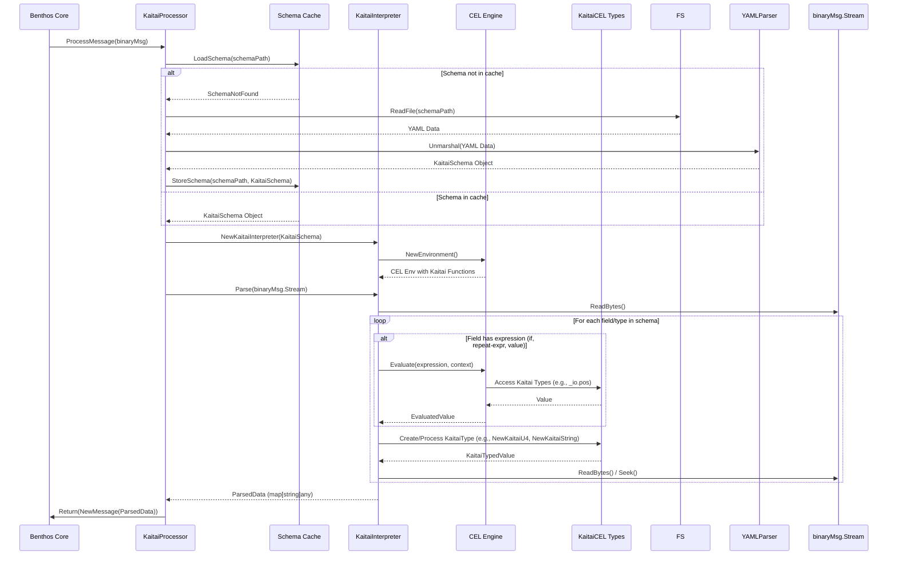

# Developer Documentation

This document provides a deeper dive into the architecture and inner workings of the Benthos Plugin for Kaitai Struct.

## Project Architecture

The plugin is designed to integrate seamlessly with Benthos while providing a robust Kaitai Struct parsing and serialization engine.

**Core Components:**

*   **`KaitaiProcessor` (`cmd/kbin-plugin/main.go`)**:
    *   Acts as the Benthos processor interface.
    *   Manages configuration (schema path, operation mode).
    *   Handles message batch processing.
    *   Instantiates and uses the `KaitaiInterpreter`.
    *   Caches parsed schemas for performance.
*   **`KaitaiInterpreter` (`pkg/kaitaistruct/parser.go`)**:
    *   The heart of the dynamic parsing/serialization logic.
    *   Takes a `KaitaiSchema` object and an input stream (for parsing) or a map (for serialization).
    *   Recursively traverses the schema's structure (`seq`, `types`, `instances`).
    *   Uses a `ParseContext` to manage the current state, including parent/root relationships and resolved values.
    *   Relies on the CEL engine for evaluating expressions defined in the KSY (e.g., `if`, `repeat-expr`, instance values).
    *   Interacts with `kaitaicel` types for handling Kaitai-specific data representations.
*   **`KaitaiSchema` (`pkg/kaitaistruct/schema.go`)**:
    *   Go struct representation of a parsed `.ksy` YAML file.
    *   Defines the structure, types, instances, and metadata of the binary format.
*   **CEL Integration (`internal/cel/` and `pkg/kaitaicel/`)**:
    *   `internal/cel/environment.go`: Sets up the core CEL environment, registering custom functions (e.g., for string manipulation, type conversion, stream operations).
    *   `pkg/kaitaicel/`: Defines custom Go types that represent Kaitai data types (e.g., `KaitaiInt`, `KaitaiString`, `KaitaiEnum`, `KaitaiBitField`). These types implement CEL interfaces, allowing them to be used directly in CEL expressions and provide Kaitai-specific behaviors.
*   **`ExpressionPool` (`internal/cel/pool.go`)**:
    *   Caches compiled CEL programs (ASTs) to avoid recompilation overhead for frequently used expressions.

**High-Level Interaction (Parsing Flow):**



## Kaitai Struct Parsing Flow

The `KaitaiInterpreter` processes a binary stream based on the provided KSY schema. Here's a simplified flowchart of the parsing logic for a single type or field:

```mermaid
graph TD
    A[Start Parsing Field/Type] --> B{Is there an 'if' condition?};
    B -- Yes --> C{Evaluate 'if' with CEL};
    C -- False --> Z[Skip Field/Type];
    C -- True --> D;
    B -- No --> D;

    D{Field Type?};
    D -- Built-in (u1, s2le, etc.) --> E[Read Bytes & Create KaitaiCEL Type];
    D -- Custom Type --> F[Recurse: ParseType(CustomTypeName)];
    D -- str/strz --> G[Read String Bytes (fixed, term, EOS)];
    G --> G1[Create KaitaiString with Encoding];
    D -- bytes --> H[Read Bytes (fixed, EOS)];
    H --> H1[Create KaitaiBytes];
    D -- switch-on --> I[Evaluate Switch Expression with CEL];
    I --> J[Resolve Actual Type Name];
    J --> F;
    D -- Other (e.g. array definition) --> K[Handle Special Logic];


    E --> L;
    F --> L;
    G1 --> L;
    H1 --> L;
    K --> L;

    L{Is there a 'process' attribute?};
    L -- Yes --> M[Apply Process (e.g., xor, zlib) via CEL];
    M --> N;
    L -- No --> N;

    N{Is there an 'enum' attribute?};
    N -- Yes --> O[Convert Value to KaitaiEnum];
    O --> P;
    N -- No --> P;

    P{Is there a 'repeat' attribute?};
    P -- Yes --> Q[Parse Repeatedly (expr, EOS, until)];
    Q --> Z;
    P -- No --> Z[End Parsing Field/Type];
```

**Key Steps in Parsing:**

1.  **Schema Loading**: The KSY file is parsed into a `KaitaiSchema` Go object.
2.  **Interpreter Instantiation**: A `KaitaiInterpreter` is created with this schema.
3.  **Root Type Parsing**: Parsing begins with the specified `root_type` or the schema's main type (`meta.id`).
4.  **Sequential Field Processing (`seq`)**: For each item in a type's `seq` array:
    *   **Conditional Check (`if`)**: If an `if` attribute exists, its CEL expression is evaluated. If false, the field is skipped.
    *   **Size Evaluation (`size`, `size-eos`)**: The size of the data to be read is determined (fixed, expression-based, or until end-of-stream).
    *   **Type Handling**:
        *   **Built-in Types**: (e.g., `u1`, `s4be`, `f8le`, `bXX`): Bytes are read from the stream, and corresponding `kaitaicel` types (e.g., `KaitaiU1`, `KaitaiS4`, `KaitaiBitField`) are instantiated.
        *   **Custom Types**: The interpreter recursively calls `parseType` for the nested type.
        *   **Strings (`str`, `strz`)**: Handled by `parseStringField`, considering encoding, fixed size, or null termination. A `KaitaiString` is created.
        *   **Bytes (`bytes`)**: Handled by `parseBytesField`. A `KaitaiBytes` object is created.
        *   **Switch Types (`switch-on`)**: The `switch-on` CEL expression is evaluated to determine the actual type to parse.
    *   **Data Processing (`process`)**: If a `process` attribute (e.g., `xor`, `zlib`) is present, the read data is transformed using corresponding CEL functions.
    *   **Repetition (`repeat`, `repeat-expr`, `repeat-until`)**: If the field is repeated, it's parsed multiple times based on the repeat condition (fixed count via CEL, EOS, or until a CEL expression is true).
    *   **Enum Conversion (`enum`)**: If an `enum` attribute is specified, the parsed integer value is converted into a `KaitaiEnum` object, which holds both the integer value and its string representation.
5.  **Instance Field Evaluation (`instances`)**: After all `seq` fields of a type are parsed, `instances` are evaluated. These are effectively calculated fields whose values are determined by CEL expressions. The evaluation order handles dependencies between instances.
6.  **Context Management (`ParseContext`)**: Throughout parsing, a `ParseContext` is maintained. It provides access to:
    *   `_io`: The current Kaitai stream, allowing expressions to use stream properties like `_io.pos` or `_io.eof`.
    *   `_parent`: The values of the parent type's fields.
    *   `_root`: The values of the root type's fields.
    *   Locally defined fields within the current type.
7.  **Result Aggregation**: The parsed data, including all child fields and instance values, is aggregated into a `ParsedData` structure, which is then typically converted to a `map[string]any` for Benthos.

## CEL Integration

Common Expression Language (CEL) is crucial for the dynamic aspects of Kaitai Struct.

*   **Environment**: `internal/cel/environment.go` sets up a CEL environment (`cel.Env`) and registers numerous custom functions that mirror or supplement Kaitai Struct's expression capabilities. These include functions for:
    *   String manipulation (e.g., `substr`, `indexOf`)
    *   Type conversion (e.g., `to_i`, `to_bytes`)
    *   Array/list operations
    *   Bitwise operations
    *   Mathematical functions
    *   Accessing Kaitai stream properties (`_io.pos`, `_io.size`, etc. via `kaitaiApiFunctions`)
    *   Data processing (e.g., `processXOR`, `processZlib`)
*   **KaitaiCEL Types (`pkg/kaitaicel/`)**: This package defines Go types that represent Kaitai's data types (e.g., `KaitaiInt`, `KaitaiString`, `KaitaiEnum`, `KaitaiFloat`, `BcdType`, `KaitaiBitField`).
    *   These types implement `ref.Val` and other CEL interfaces, allowing them to be directly used and manipulated within CEL expressions.
    *   They encapsulate the raw bytes and the interpreted value, and provide methods that can be called from CEL (e.g., a `KaitaiString` might have a `.length()` method).
*   **Expression Evaluation**: When the `KaitaiInterpreter` encounters an expression (e.g., in an `if` condition, a `size` attribute, or an `instances` value), it:
    1.  Uses the `ExpressionPool` to get a compiled CEL program (AST) for the expression string.
    2.  Creates an `Activation` from the current `ParseContext`. This activation makes available:
        *   Previously parsed fields in the current type.
        *   `_io`, `_parent`, and `_root` variables.
        *   The custom functions registered in the CEL environment.
    3.  Evaluates the CEL program with this activation.
*   **Error Handling**: CEL evaluation errors are caught and reported by the interpreter.

## Class Diagram

The following diagram illustrates the key classes and their relationships in the plugin.


A StarUML project file (`kaitai_plugin_classes.mdj`) containing this diagram is located in the `docs/` directory.

**Key Classes and Structs:**

*   **`cmd.KaitaiProcessor`**: Benthos processor, entry point.
*   **`kaitaistruct.KaitaiInterpreter`**: Core parsing/serialization logic.
*   **`kaitaistruct.KaitaiSchema`**: Represents the KSY schema.
    *   `Meta`, `SequenceItem`, `Type`, `InstanceDef`, `EnumDef`
*   **`kaitaistruct.ParseContext`**: Runtime context for parsing.
*   **`kaitaistruct.ParsedData`**: Tree-like structure for parsed results.
*   **`internal.cel.ExpressionPool`**: Caches compiled CEL expressions.
*   **`kaitaicel.KaitaiType` (interface)**: Common interface for Kaitai-specific types.
    *   `KaitaiInt`, `KaitaiString`, `KaitaiBytes`, `KaitaiFloat`, `KaitaiEnum`, `BcdType`, `KaitaiBitField`, etc. (concrete types in `pkg/kaitaicel/`)

## Building and Testing

**Building:**

```shell
# Ensure Go (1.20+) is installed.
# From the project root directory:
go build -o kbin-benthos-plugin ./cmd/kbin-plugin
```

This will create a binary `kbin-benthos-plugin`. The exact way to integrate this with your Benthos instance depends on your Benthos deployment strategy (e.g., custom Benthos build, sidecar, etc.).

**Testing:**

The project includes unit tests for various components. Kaitai Struct's own test formats (`.ksy` files from the Kaitai Struct project) are used extensively to validate the interpreter's correctness.

```shell
# Run all tests from the project root directory:
go test ./...

# Run tests for a specific package:
go test ./pkg/kaitaistruct -v
go test ./internal/cel -v
```

You can find test files (`*_test.go`) alongside the code they are testing. The `test/` directory contains Kaitai Struct format files (`.ksy`) and corresponding binary data (`.bin`) used for end-to-end parsing tests.
